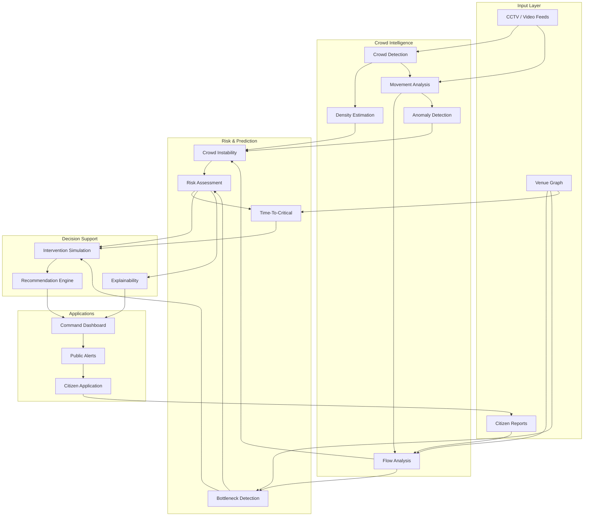
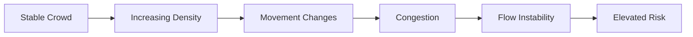
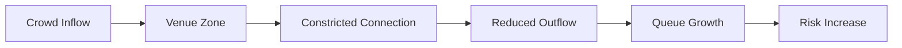
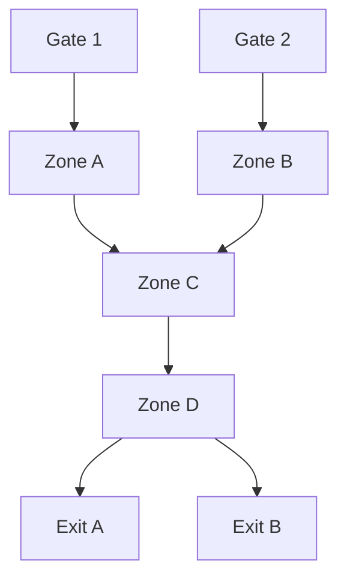
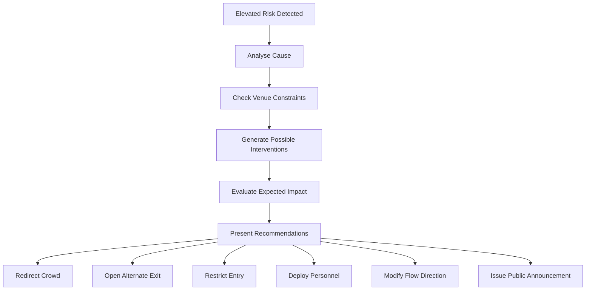
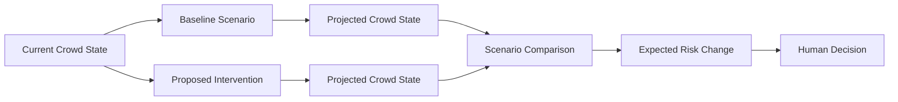
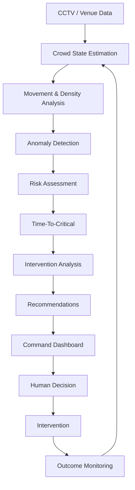

# CROWDShield

## AI-Powered Early Warning System for Crowd Safety

CROWDShield is an intelligent crowd-safety platform designed to detect abnormal crowd conditions, identify emerging risks, estimate how quickly a situation may become critical, and provide actionable recommendations to authorities before a crowd-related emergency develops.

The system combines real-time crowd monitoring, movement analysis, venue modelling, risk assessment, predictive intelligence, intervention recommendations, and operator decision support into a single platform.

---

## Overview

Large public gatherings can become difficult to manage when crowd density increases rapidly, pedestrian flows converge, exits become constrained, or abnormal movement begins to develop.

Conventional monitoring systems primarily show what is happening at a particular moment. CROWDShield extends this approach by continuously analysing changes in crowd behaviour and using those signals to identify emerging risks.

The system is designed around a simple operational loop:

```text
Observe
   ↓
Measure
   ↓
Analyse
   ↓
Predict
   ↓
Recommend
   ↓
Human Decision
   ↓
Intervene
   ↓
Monitor Outcome
   ↓
Analyse Again
```

The objective is not to replace human authorities. Instead, CROWDShield provides them with better information, earlier warnings, and structured decision support.

---

## Problem

Crowd-related incidents are often preceded by measurable changes in the movement and distribution of people.

Examples include:

- Rapid increases in crowd density
- Sudden changes in movement speed
- Opposing or irregular movement
- Increasing congestion near exits and corridors
- Bottlenecks caused by limited passage capacity
- Sudden crowd surges
- Imbalances between incoming and outgoing crowd flow
- Propagation of abnormal movement into neighbouring areas

Detecting these conditions early is difficult when operators have to monitor multiple camera feeds and interpret changing conditions manually.

CROWDShield addresses this problem by converting raw crowd observations into structured crowd-state information and actionable risk intelligence.

---

## Solution

CROWDShield continuously evaluates the state of a venue and its crowd.

The platform can:

1. Monitor crowd density and movement.
2. Estimate crowd speed and direction.
3. Identify abnormal movement patterns.
4. Detect congestion and bottlenecks.
5. Evaluate crowd instability.
6. Estimate Time-To-Critical for developing situations.
7. Assess risk across different venue zones.
8. Generate possible intervention strategies.
9. Present explanations and recommendations through a command dashboard.
10. Provide location-aware information to citizens.
11. Monitor the effect of interventions after they are applied.

---

## System Architecture



---

# Core Components

## 1. Crowd Monitoring

CROWDShield processes crowd observations to build a continuously updated representation of the crowd state.

The monitoring layer focuses on both the number of people in an area and how those people are moving.

| Parameter | Purpose |
|---|---|
| Density | Measures the concentration of people within a zone |
| Movement Speed | Tracks how quickly the crowd is moving |
| Flow Direction | Identifies the dominant direction of movement |
| Flow Coherence | Determines whether movement is organised or irregular |
| Congestion | Identifies areas where movement is becoming constrained |
| Inflow | Measures movement entering a zone |
| Outflow | Measures movement leaving a zone |
| Behavioural Anomalies | Identifies unusual changes in movement patterns |

This provides the foundation for the subsequent risk and prediction layers.

---

## 2. Crowd Instability Analysis

Crowd density by itself does not fully describe crowd safety.

A high-density area may remain stable when movement is organised. Conversely, rapidly changing movement patterns, opposing flows, and increasing congestion can indicate that a situation is becoming unstable.

CROWDShield therefore considers multiple signals together.



The system evaluates changes in:

- Density
- Velocity
- Velocity variation
- Direction
- Flow coherence
- Inflow and outflow
- Local congestion
- Bottleneck conditions

---

## 3. Bottleneck Detection

A venue may have sufficient total capacity while still containing individual locations where crowd movement becomes restricted.

CROWDShield models relationships between venue zones, corridors, gates, and exits to identify these constrained areas.



Potential bottleneck conditions include:

- Overloaded corridors
- Restricted exits
- Entry surges
- Reduced outflow
- Counterflow
- Rapid queue growth
- Route blockages

---

## 4. Time-To-Critical

One of the key concepts in CROWDShield is Time-To-Critical (TTC).

Instead of reporting only the current risk state, the system estimates how quickly a zone may approach a defined critical condition based on its current state and trajectory.

```text
Current Crowd State
        |
        v
+-------------------------+
| Density increasing      |
| Movement changing       |
| Bottleneck developing   |
| Outflow decreasing      |
+------------+------------+
             |
             v
      Time-To-Critical
             |
             v
+-------------------------+
| Estimated time until    |
| critical threshold      |
| may be reached          |
+------------+------------+
             |
             v
     Early Intervention
```

TTC is intended to provide authorities with additional lead time for preventive action.

It is an estimate based on observed conditions and system assumptions, not a guarantee that a particular event will occur.

---

## 5. Risk Assessment

CROWDShield combines multiple crowd-state indicators to assess risk across individual venue zones.

The risk layer considers conditions such as:

| Condition | Example Signal |
|---|---|
| High Density | Increasing concentration of people |
| Flow Instability | Rapid or irregular movement changes |
| Counterflow | Conflicting movement directions |
| Crowd Surge | Sudden increase in incoming flow |
| Bottleneck | Restricted movement through a connection |
| Route Blockage | Reduced availability of a movement path |
| Outflow Imbalance | Incoming flow exceeding outgoing flow |

This allows risk to be evaluated in context rather than using crowd density as the only indicator.

---

## 6. Venue Digital Twin

CROWDShield represents the physical venue as a structured graph.

A venue can contain:

- Zones
- Gates
- Corridors
- Exits
- Connections
- Capacities
- Movement relationships
- Current crowd states

A simplified representation looks like this:



The venue graph provides the structural context required for:

- Crowd-flow analysis
- Bottleneck detection
- Route analysis
- Gate management
- Intervention planning
- Simulation

---

# 7. Intervention Recommendation

CROWDShield is designed to go beyond simply generating an alert.

When elevated risk is detected, the system evaluates the current venue conditions and generates possible interventions.



Possible interventions include:

- Redirecting incoming visitors
- Opening alternate exits
- Restricting or changing gate access
- Redirecting people through alternate routes
- Redistributing security personnel
- Configuring one-way movement
- Modifying pedestrian flow
- Issuing public announcements

Recommendations are presented as decision-support options for human operators.

---

# 8. Intervention Simulation

Before an intervention is executed, CROWDShield can compare the current situation against a proposed intervention scenario.



This allows operators to evaluate the expected effect of actions such as:

- Changing entry restrictions
- Redirecting crowd flow
- Opening alternate exits
- Changing route availability
- Redistributing movement across zones

Simulation results are intended to support operational decisions under the assumptions represented by the model.

---

# 9. Explainable Risk Alerts

CROWDShield provides contextual information alongside risk alerts.

Instead of displaying only:

```text
HIGH RISK
```

the system can communicate:

```text
Zone C — Elevated Risk

Primary contributing conditions:
- Increasing crowd density
- Reduced movement speed
- Developing bottleneck
- Increasing inflow
- Reduced outflow

Estimated Time-To-Critical:
7–10 minutes

Recommended action:
Redirect incoming visitors toward an alternate route.
```

The purpose of the explainability layer is to allow operators to understand why the system has identified a particular zone as requiring attention.

---

# Command Dashboard

The command dashboard provides a centralized view of the venue and current crowd conditions.

The interface is designed around the information required by operators during an active event.

### Dashboard capabilities

| Module | Function |
|---|---|
| Venue Map | Displays the structure and current state of the venue |
| Crowd Heatmap | Shows crowd concentration across zones |
| Risk Map | Highlights areas with elevated risk |
| Flow Monitoring | Displays movement patterns and directions |
| Bottleneck View | Identifies constrained locations |
| TTC Indicators | Displays estimated Time-To-Critical |
| Alerts | Provides operational warnings |
| Recommendations | Presents possible interventions |
| Explainability | Shows factors contributing to risk |
| Trends | Tracks crowd conditions over time |
| Incident History | Maintains information about previous events |

---

# Citizen Application

CROWDShield extends the safety system beyond the command centre through a companion citizen-facing application.

The application is designed to provide people attending an event with relevant information about their surroundings.

### Citizen features

- Location-aware safety notifications
- Congestion warnings
- Public announcements
- Multilingual alerts
- Safety guidance
- Incident reporting

The citizen application also provides an additional source of information through user-submitted incident reports.

---

# Multilingual Communication

Large public gatherings can include people from different linguistic backgrounds.

CROWDShield supports multilingual communication for public-facing safety information, including:

- Congestion warnings
- Emergency notifications
- Public announcements
- Safety instructions

The objective is to make critical information understandable to a wider group of people during an event.

---

# End-to-End Workflow



This creates a continuous feedback loop rather than a one-time alerting system.

---

# Human-in-the-Loop Architecture

CROWDShield is designed as a decision-support platform.

The system performs:

```text
Observation
     ↓
Analysis
     ↓
Prediction
     ↓
Recommendation
```

The final operational decision remains with authorised personnel:

```text
Recommendation
     ↓
Human Review
     ↓
Operational Decision
     ↓
Intervention
```

This design ensures that AI-generated recommendations support, rather than replace, human judgement during safety-critical situations.

---

# Privacy and Responsible AI

CROWDShield is designed with public safety and responsible data handling in mind.

Key principles include:

| Principle | Approach |
|---|---|
| Data Minimisation | Use information necessary for crowd-safety functions |
| Privacy | Avoid unnecessary personal identification |
| Explainability | Provide context for important risk alerts |
| Human Oversight | Keep operational decisions under human control |
| Uncertainty | Communicate that predictions are estimates |
| Reliability | Corroborate multiple signals where appropriate |
| Security | Protect operational and citizen information |

The system's purpose is to understand **crowd behaviour and movement**, rather than unnecessarily identifying individual people.

---

# Network and Deployment Considerations

CROWDShield is intended for real-world public-event environments where infrastructure may vary.

The architecture considers:

- Existing CCTV infrastructure
- Variable network availability
- Low-bandwidth environments
- Real-time monitoring requirements
- Distributed venue layouts
- Graceful degradation during connectivity issues
- Integration with existing operational workflows

The system is designed to build on existing infrastructure rather than requiring every venue to replace its current surveillance setup.

---

# Use Cases

CROWDShield is applicable to environments where large numbers of people gather and move through shared spaces.

Potential deployment environments include:

| Environment | Example Scenario |
|---|---|
| Religious Gatherings | Managing large visitor flows |
| Festivals | Monitoring temporary event infrastructure |
| Stadiums | Managing entry, exit and post-event movement |
| Concerts | Detecting congestion around stages and exits |
| Public Celebrations | Monitoring rapidly changing crowd conditions |
| Processions | Tracking movement through constrained routes |
| Transportation Hubs | Managing passenger congestion |
| Temporary Venues | Supporting crowd management during large events |

---

# Data Model

The project uses structured schemas to represent venue and telemetry information.

The repository contains:

```text
schemas/
│
├── examples/
│   ├── mini-venue.telemetry-frame.json
│   └── mini-venue.topology.json
│
├── validate.py
├── venue-graph.schema.json
├── venue-telemetry-frame.schema.json
└── _draft202012_subset.py
```

These schemas provide structured contracts for the venue model and telemetry data used by the platform.

---

# Repository Structure

```text
CROWDShield/
│
├── docs/
│   ├── SPEC-v1.md
│   └── VENUE-GRAPH.md
│
├── schemas/
│   ├── examples/
│   │   ├── mini-venue.telemetry-frame.json
│   │   └── mini-venue.topology.json
│   │
│   ├── validate.py
│   ├── venue-graph.schema.json
│   ├── venue-telemetry-frame.schema.json
│   └── _draft202012_subset.py
│
└── README.md
```

---

# Technical Documentation

Detailed system documentation is available in the repository.

### System Specification

[`docs/SPEC-v1.md`](docs/SPEC-v1.md)

Contains the detailed product and technical specification for CROWDShield.

### Venue Graph

[`docs/VENUE-GRAPH.md`](docs/VENUE-GRAPH.md)

Describes the venue graph and its role in modelling zones, connections and crowd movement.

### Venue Graph Schema

[`schemas/venue-graph.schema.json`](schemas/venue-graph.schema.json)

Defines the structure of venue topology data.

### Telemetry Schema

[`schemas/venue-telemetry-frame.schema.json`](schemas/venue-telemetry-frame.schema.json)

Defines the structure of crowd telemetry data.

---

# System Design Principles

CROWDShield follows several core principles throughout its architecture.

### Predict Before React

The system focuses on identifying developing conditions rather than waiting for an emergency.

### Analyse Movement, Not Only Density

Crowd behaviour depends on how people move, not simply how many people are present.

### Recommend Actions

The platform connects detected risks with possible operational interventions.

### Explain Important Alerts

Operators should be able to understand the conditions contributing to an alert.

### Keep Humans in the Loop

The system provides decision support while operational authority remains with humans.

### Work With Existing Infrastructure

The platform is designed around existing CCTV and venue infrastructure where possible.

---

# Future Extensions

The architecture can support additional capabilities around the core crowd-intelligence platform.

Potential extensions include:

- More advanced crowd simulation
- Expanded venue digital-twin capabilities
- Voice-based command-centre interaction
- Multilingual AI assistance
- Automated incident summaries
- Additional sensor integrations
- Larger multi-venue deployments

These capabilities can be integrated without changing the central CROWDShield workflow.

---

# Project Vision

CROWDShield is built around a simple shift in crowd management:

```text
Traditional Approach

Observe → Detect Problem → Respond


CROWDShield

Observe → Understand → Predict → Recommend → Act → Verify
```

The purpose is to provide authorities with information early enough to make preventive decisions.

A crowd-safety system should not only tell operators that a problem exists.

It should help them understand:

- Where the problem is developing
- What is causing the change
- How quickly the situation may become critical
- Which interventions are available
- What effect those interventions may have
- Whether the situation improves after action is taken

---

# Conclusion

CROWDShield combines crowd monitoring, movement analysis, venue modelling, risk assessment, Time-To-Critical estimation, intervention recommendations, simulation, and human-centred decision support into a unified crowd-safety platform.

Its core objective is straightforward:

> **Identify dangerous crowd conditions early enough to support preventive action.**

```text
See the crowd.
Understand the movement.
Predict the risk.
Support the decision.
Prevent the emergency.
```

---

## Project Status

CROWDShield represents a complete implementation of the proposed crowd-safety platform, including its monitoring, intelligence, prediction, decision-support and citizen-facing components.

For detailed technical specifications and data definitions, refer to the documentation in the `docs/` and `schemas/` directories.
